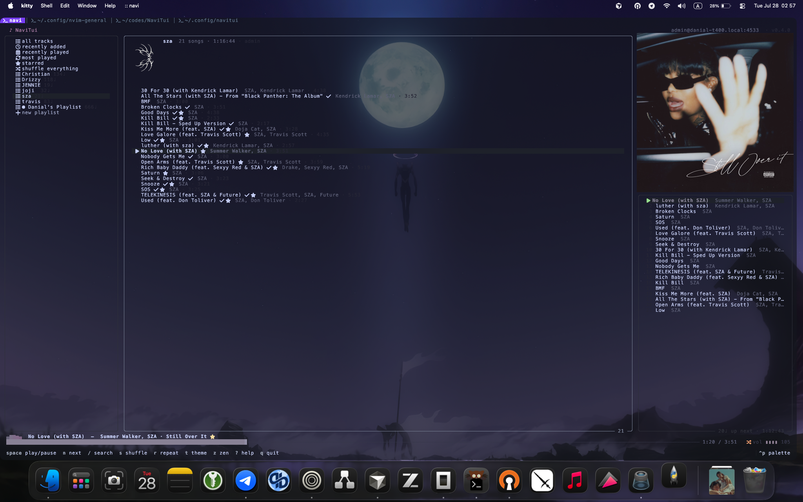

<div align="center">

# ♪ NaviTui

A fork of [Gheat1/NaviTui](https://github.com/Gheat1/NaviTui) — I added stuff I liked and changed the UI a bit.



</div>

## Install

```sh
cd ~/codes
git clone https://github.com/danial2026/NaviTui.git
cd NaviTui
source .venv/bin/activate
navitui
```

Add to your `~/.zshrc` or `~/.bashrc` for easier access:

```sh
alias navi="~/codes/NaviTui/.venv/bin/navitui"
```

## Keybindings

Press `?` for the full cheatsheet.

| key | action | key | action |
| --- | --- | --- | --- |
| `space` | play/pause | `s` | shuffle |
| `n`/`b` | next/prev | `r` | repeat |
| `←`/`→` | seek 5s | `m` | mute |
| `-`/`+` | volume | `z` | zen mode |
| `/` | search | `ctrl+g` | switch server |
| `a` | enqueue | `f` | star |
| `d` | download | `L` | lyrics |
| `q` | quit | `?` | help |

## Links

- [Forked from Gheat1/NaviTui](https://github.com/Gheat1/NaviTui)
- GPL-3.0-or-later
